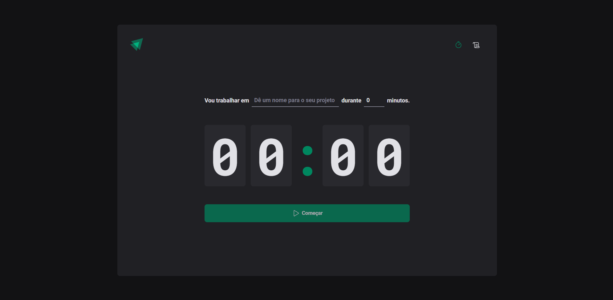

# Ignite Timer

<<<<<<< HEAD

=======

>>>>>>> 82d029b09432a6249294f0614aad1034552532d9

## Descrição

O **Ignite Timer** é um projeto desenvolvido como parte do curso de ReactJS da Rocketseat, conhecido como Ignite. Este projeto é um aplicativo de gerenciamento de tempo baseado na técnica Pomodoro, que ajuda a organizar e gerenciar suas tarefas de forma eficiente.

## Funcionalidades

- Criação de cronômetros personalizados
- Notificações sonoras e visuais para pausas e conclusões de tarefas
- Histórico de tarefas e tempos registrados
- Interface intuitiva e responsiva

## Tecnologias Utilizadas

- **ReactJS** - Biblioteca para construção da interface
- **TypeScript** - Superset do JavaScript que adiciona tipagem estática
- **React Hook Form** - Biblioteca para gerenciamento de formulários
- **Zod** - Validação de esquemas e dados
- **Styled Components** - Estilização de componentes com CSS-in-JS
- **React Router** - Navegação e roteamento
- **Phosphor Icons** - Ícones para a interface
- **React Context API** - Gerenciamento de estado global

## Instalação

Para começar a usar o Ignite Timer localmente, siga os passos abaixo:

1. **Clone o repositório:**

   ```bash
   git clone https://github.com/leandrolima132/02-ignite-timer.git
   ```

2. **Navegue até o diretório do projeto:**

   ```bash
   cd 02-ignite-timer
   ```

3. **Instale as dependências:**
   ```bash
   npm install
   ```
4. **Inicie o servidor de desenvolvimento:**
   ```bash
   npm start
   ```
